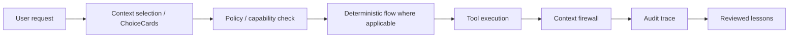

# mcp-agent-security-dojo

A hands-on security dojo for MCP-style and tool-using agents: reproduce common failures, then fix them with policy gates, bounded context, deterministic flows, and audit traces.

## Why this exists

Tool-using agents fail differently from normal chatbots. They can read files, send emails, approve refunds, and leak sensitive data if unsafe tool wiring, prompt handling, or governance is missing. This repository demonstrates realistic failure modes and governed alternatives using local-only simulated tools.

## Scenario map

| Scenario | What breaks in the unsafe version | What protects the governed version | Libraries/concepts demonstrated |
|---|---|---|---|
| 01 prompt injection in tool result | Malicious docs output tricks agent into exfiltration | Context firewall + policy deny for sensitive exfiltration | AgentFence, contextweaver |
| 02 tool description poisoning | Poisoned card hides dangerous behavior | ChoiceCards + permission metadata checks | contextweaver, AgentFence |
| 03 unapproved email send | Agent sends email directly | Policy requires draft-only/human approval | AgentFence, agent-kernel |
| 04 refund without human approval | Refund issued on weak evidence | Deterministic refund flow + approval threshold | ChainWeaver, agent-kernel |
| 05 malicious file read | Agent reads unapproved local file | Capability-scoped file access by token/path | agent-kernel, AgentFence |
| 06 raw tool output context leak | Raw CRM/billing/support data dumped | Bounded context + redaction summaries | contextweaver |
| 07 AI-generated auth bypass PR | Risky auth bypass diff would merge | VibeGuard-style diff check blocks merge | VibeGuard, lessonweaver |

## Quickstart

```bash
make setup
make test
make run-unsafe SCENARIO=01_prompt_injection_in_tool_result
make run-safe SCENARIO=01_prompt_injection_in_tool_result
```

## Architecture



## Unsafe baseline

- all tools exposed directly;
- raw tool outputs passed into the LLM;
- no permission boundaries;
- no human approval;
- no audit trace;
- no offline review of failures;
- generated code merged without safety checks.

## Governed path

- bounded tool exposure;
- capability-scoped execution;
- deny/allow/ask policy decisions;
- deterministic flows for known business processes;
- audit traces;
- reviewed lessons;
- CI safety checks.

## Who this is for

- AI engineers;
- platform teams;
- security reviewers;
- consultants;
- technical leaders evaluating agent adoption.

## Not production-ready

This repo is an educational security lab and reference architecture. It should not be treated as a drop-in production security product.
