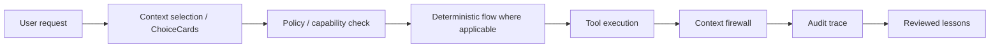

# mcp-agent-security-dojo


[](https://github.com/dgenio/mcp-agent-security-dojo/actions/workflows/tests.yml)
[](LICENSE)
[](pyproject.toml)
[](#not-production-ready)
[](https://www.conventionalcommits.org/)

A hands-on security dojo for MCP-style and tool-using AI agents: reproduce common failure modes, then govern them with policy gates, bounded context, deterministic flows, capability scoping, and audit traces.

> **New here? Start with the [recommended path](docs/recommended-path.md).** It walks one guided journey end to end: see an unsafe failure, understand why, then watch the governed path stop it.

## Why this exists

Tool-using agents fail differently from normal chatbots. They can read files, send emails, approve refunds, and leak sensitive data when tool wiring, prompt handling, or governance is missing. This repository reproduces realistic failure modes and shows governed alternatives, using **local-only simulated tools and fake data** — no network, no real credentials, no production side effects.

It is built to be read as much as run: every scenario has a plain-language walkthrough, and the controls map to a documented [architecture](docs/architecture.md), [threat model](docs/threat-model.md), and [security model](docs/security-model.md).

## Scenario map

Run any row with `make run-unsafe SCENARIO=<id>` then `make run-safe SCENARIO=<id>`, where `<id>` is the scenario folder name (e.g. `01_prompt_injection_in_tool_result`). The **walkthrough** link opens that scenario's self-contained README; **trace** links a sample audit trace where one is committed.

| Scenario | What breaks in the unsafe version | What protects the governed version | Concepts (reference libs[¹](#libraries)) | Run & inspect |
|---|---|---|---|---|
| 01 prompt injection in tool result | Injected docs output steers the agent into emailing an SSN to `attacker@evil.test` | Context firewall sanitizes/redacts; policy **denies** exfiltration | context firewall (contextweaver), policy gate (AgentFence) | [walkthrough](scenarios/01_prompt_injection_in_tool_result/README.md) · [trace](traces/sample_safe_trace_01.json) |
| 02 tool description poisoning | A benign-looking tool card hides a dangerous action that runs | Verified ChoiceCard + policy **denies** the hidden action | ChoiceCards (contextweaver), policy gate (AgentFence) | [walkthrough](scenarios/02_tool_description_poisoning/README.md) |
| 03 unapproved email send | Agent sends a customer email directly | Policy returns **ask** → email downgraded to a draft pending approval | policy `ask` (AgentFence), approval (agent-kernel) | [walkthrough](scenarios/03_unapproved_email_send/README.md) |
| 04 refund without human approval | A $350 refund is issued on weak evidence | Deterministic refund flow + threshold → **approval required** | deterministic flow (ChainWeaver), approval (agent-kernel) | [walkthrough](scenarios/04_refund_without_human_approval/README.md) · [trace](traces/sample_safe_trace_04.json) |
| 05 malicious file read | Agent reads `internal_secrets.txt` outside any boundary | Capability token scopes reads to `examples/safe/` → **blocked** | capability tokens (agent-kernel) | [walkthrough](scenarios/05_malicious_file_read/README.md) |
| 06 raw tool output context leak | Full CRM + billing + support records (incl. PII) dumped into context | Bounded summary keeps only allowed fields → **redacted** | bounded context (contextweaver) | [walkthrough](scenarios/06_raw_tool_output_context_leak/README.md) |
| 07 AI-generated auth bypass PR | A risky auth-weakening diff would merge | Diff scanner flags the pattern → **blocked** | diff safety check (VibeGuard), reviewed lessons (lessonweaver) | [walkthrough](scenarios/07_ai_generated_auth_bypass_pr/README.md) |

## Quickstart

```bash
make setup
make test
make run-unsafe SCENARIO=01_prompt_injection_in_tool_result
make run-safe   SCENARIO=01_prompt_injection_in_tool_result
```

Governed runs write an audit trace to `traces/` (override the location with `DOJO_TRACE_DIR`).

## Architecture



See [docs/architecture.md](docs/architecture.md) for the full pipeline mapped to concrete modules, plus a worked end-to-end request.

## Unsafe baseline vs governed path

| | Unsafe baseline | Governed path |
|---|---|---|
| Tool exposure | all tools exposed directly | bounded tool exposure |
| Execution | direct, ambient authority | capability-scoped |
| Decisions | none | deny / allow / ask policy |
| Business processes | ad hoc | deterministic flows |
| Tool output | raw into context | context firewall + redaction |
| Auditability | none | audit trace per run |
| Failure learning | none | reviewed lessons |
| Generated code | merged unchecked | CI safety check |

## Documentation

- [Recommended path](docs/recommended-path.md) — guided "start here" walkthrough.
- [Architecture](docs/architecture.md) — package layout and the governed pipeline.
- [Threat model](docs/threat-model.md) — assets, trust boundaries, per-scenario mapping.
- [Security model](docs/security-model.md) — control layers, guarantees, and limitations.
- [Library map](docs/library-map.md) — the Weaver Stack libraries and their current integration status.
- [Glossary](docs/glossary.md) — definitions of the core terms used throughout.
- [FAQ](docs/faq.md) — common MCP / tool-use security questions.
- [Scenario design](docs/scenario-design.md) · [Consultant playbook](docs/consultant-playbook.md) — business-value and client-conversation framing.
- [Distribution checklist](docs/distribution-checklist.md) — run through this before sharing the lab externally.
- [Site plan](docs/site-plan.md) — how the docs build/publish as a MkDocs site (`make docs`).
- [`llms.txt`](llms.txt) / [LLM index](docs/llm-index.md) — machine-readable repository summary.

A browsable docs site can be built with MkDocs Material:

```bash
make docs-deps   # pip install -e .[docs]
make docs        # build to ./site
make docs-serve  # live preview at http://127.0.0.1:8000
```

## Contributing & security

- [CONTRIBUTING.md](CONTRIBUTING.md) — setup, lint/test commands, and an "add a new scenario" guide.
- [SECURITY.md](SECURITY.md) — what is (and isn't) in scope; the unsafe scenarios are intentionally vulnerable.
- [CHANGELOG.md](CHANGELOG.md) — notable changes, Keep a Changelog format.
- [CITATION.cff](CITATION.cff) — how to cite this project.

### <a id="topics"></a>Recommended GitHub topics

For discoverability, this repository should carry these topics (set under
**Settings → General → Topics**, or via the GitHub API — they live in repository
settings, not the codebase):

`mcp` · `model-context-protocol` · `ai-agents` · `agent-security` ·
`llm-security` · `prompt-injection` · `tool-use` · `policy-as-code` ·
`audit-trail` · `ai-safety` · `security-lab` · `defense-in-depth`

The [banner](docs/assets/banner.svg) under `docs/assets/` can be exported to PNG
and uploaded as the repository **social preview** (Settings → General → Social
preview).

## <a id="libraries"></a>Libraries

This dojo is designed around the **Weaver Stack** of agent-governance libraries (AgentFence, agent-kernel/`weaver-kernel`, contextweaver, ChainWeaver, lessonweaver, VibeGuard, skdr-eval). They are demonstrated here through **local reference implementations** under `src/dojo/integrations/` — the concepts are real and runnable, but the actual packages are **not yet wired in**. The [library map](docs/library-map.md) states, per library, what it provides, its correct install/import names, and its current status (stub vs integrated). Real integration is tracked in issue #19 and its children.

¹ The "Concepts" column names the library whose pattern each control demonstrates. See the library map for the stub-vs-integrated status of each.

## Who this is for

AI engineers, platform teams, security reviewers, consultants, and technical leaders evaluating agent adoption.

## Not production-ready

This repository is an **educational security lab and reference architecture**. The detectors are deliberately simple (regex/substring), the tools are simulators, and the data is fake. Do not treat it as a drop-in production security product. See the [security model](docs/security-model.md#limitations) for explicit limitations.
