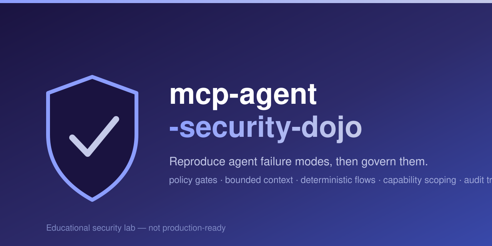
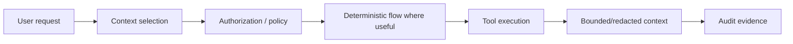

# mcp-agent-security-dojo



[](https://github.com/dgenio/mcp-agent-security-dojo/actions/workflows/tests.yml)
[](https://github.com/dgenio/mcp-agent-security-dojo/actions/workflows/vibeguard.yml)
[](LICENSE)
[](pyproject.toml)
[](#not-production-ready)

A hands-on security dojo for MCP-style and tool-using AI agents: reproduce concrete failure modes, compare reasonable mitigations, inspect the evidence, and keep the residual risk visible.

> **Portfolio role: BREAK IT.** This repo is the security-failure/mitigation lab. It is not the whole Weaver Stack, a production security gateway, or a benchmark designed to prove dgenio software with dgenio-authored tests. See the [flagship strategy](docs/flagship-strategy.md).

## Start here: three flagship failures

The primary journey is deliberately small. Run these three scenarios before exploring the extended lab:

| Problem | Scenario | Primary control being proved |
|---|---|---|
| Untrusted context / tool-result injection | [01 prompt injection](scenarios/01_prompt_injection_in_tool_result/README.md) | `contextweaver` real path when integrated |
| Unauthorized outbound action | [03 unapproved email](scenarios/03_unapproved_email_send/README.md) | `weaver-kernel` + AgentFence boundary |
| Known high-risk business process | [04 refund without approval](scenarios/04_refund_without_human_approval/README.md) | `chainweaver` + authorization/policy around the write |

Today the runnable governed implementations are local educational/reference implementations. **They do not yet prove that the named sibling packages ran.** Real-library integration for the flagship path is tracked in [#19](https://github.com/dgenio/mcp-agent-security-dojo/issues/19); the canonical tour is tracked in [#100](https://github.com/dgenio/mcp-agent-security-dojo/issues/100).

The target evidence shape for each flagship case is:

```text
unsafe baseline
  vs
competent DIY/reference mitigation
  vs
real relevant OSS component
```

A requested real mode must never silently fall back to local code.

## Quickstart

```bash
make help
make setup
make doctor
make test

make run-unsafe SCENARIO=01_prompt_injection_in_tool_result
make run-safe   SCENARIO=01_prompt_injection_in_tool_result

make run-unsafe SCENARIO=03_unapproved_email_send
make run-safe   SCENARIO=03_unapproved_email_send

make run-unsafe SCENARIO=04_refund_without_human_approval
make run-safe   SCENARIO=04_refund_without_human_approval
```

Governed runs write an audit trace to `traces/` (override the location with `DOJO_TRACE_DIR`).

> **Zero local setup:** open the repo in GitHub Codespaces or a local [devcontainer](.devcontainer/devcontainer.json); `make setup` runs automatically on create.

## What strong evidence means here

A scenario should not be tuned into a perfect marketing demo. Strong evidence includes:

- a reproducible unsafe failure;
- a legitimate action that still succeeds under governance;
- a competent DIY/reference mitigation;
- an actual real-library path when available, with version/commit provenance;
- adversarial variants beyond the canonical authored string;
- benign near-matches to expose false positives;
- explicit limitations, known bypasses, and control-failure behavior.

External contributions that **break the governed path** are welcome. See the [external red-team challenge](docs/red-team-challenge.md).

Before broad promotion, the flagship is gated by blind-user evidence: strangers should be able to get value from the repo without maintainer narration and should understand what the controls do *and do not* guarantee. See the [blind-user adoption gate](docs/blind-user-gate.md).

## Extended scenario map

The remaining scenarios are useful exercises, but they are not first-run blockers and must not force unrelated dependencies into the flagship install.

Run any row with `make run-unsafe SCENARIO=<id>` and `make run-safe SCENARIO=<id>`.

| Scenario | Unsafe failure | Governed/reference control | Concepts |
|---|---|---|---|
| 01 prompt injection in tool result | Injected docs output steers exfiltration | Context firewall sanitizes/redacts; policy denies | contextweaver, AgentFence |
| 02 tool description poisoning | Poisoned tool card hides a dangerous action | Verified ChoiceCard + policy denial | contextweaver, AgentFence |
| 03 unapproved email send | Agent sends directly | `ask` / approval boundary | AgentFence, agent-kernel |
| 04 refund without human approval | Refund runs on weak evidence | Deterministic review flow + approval | ChainWeaver, agent-kernel |
| 05 malicious file read | Agent reads outside its boundary | Scoped capability token | agent-kernel |
| 06 raw tool output context leak | PII-heavy records enter context | Bounded/redacted summary | contextweaver |
| 07 AI-generated auth bypass PR | Risky generated diff would merge | Diff-safety/reference learning controls | VibeGuard, lessonweaver |
| 08 ambient-authority privilege escalation | Injected note steers a privileged write | Policy + capability boundary | AgentFence, agent-kernel |

## Architecture



See [docs/architecture.md](docs/architecture.md), [docs/threat-model.md](docs/threat-model.md), and [docs/security-model.md](docs/security-model.md) for the detailed teaching architecture and limitations.

## Current real-library status

The repo currently contains **local reference implementations** under `src/dojo/integrations/`. The concepts are runnable; the named sibling packages are not yet wired into the flagship path.

The real-integration plan is intentionally minimal:

- Scenario 01 → `contextweaver`;
- Scenario 03 → `weaver-kernel` plus real AgentFence as its Go/sidecar boundary;
- Scenario 04 → `chainweaver`, with authorization/policy around the write.

Do not `pip install agentfence` expecting `dgenio/agentfence`: that PyPI name belongs to an unrelated project. The dgenio AgentFence is handled as its real Go/sidecar or Action boundary.

`lessonweaver`, VibeGuard, and `skdr-eval` are not required merely to make the flagship look like a complete stack. Secondary exercises can remain useful without making those projects first-run dependencies.

See [docs/library-map.md](docs/library-map.md) and [#19](https://github.com/dgenio/mcp-agent-security-dojo/issues/19) for the integration status.

## Scope discipline

Until the flagship passes its blind-user/adoption gate, these are deliberately not priorities:

- a hosted playground or live MCP product;
- a leaderboard or LLM judge;
- workshop/content-production machinery;
- GitHub Pages as a growth project;
- taxonomy/compliance mapping as a substitute for reproducible evidence;
- adding more scenarios because onboarding or downstream conversion is weak;
- installing every Weaver project in every demo.

If two serious distribution experiments produce essentially no downstream behavior, freeze the lab as a stable educational asset rather than adding more features. The full GO / ITERATE / FREEZE / MERGE / ARCHIVE rules are in [docs/blind-user-gate.md](docs/blind-user-gate.md).

## Documentation

- [Flagship strategy](docs/flagship-strategy.md) — scope, evidence hierarchy, and relationship to the other labs.
- [Blind-user adoption gate](docs/blind-user-gate.md) — falsifiable launch/continue/freeze criteria.
- [External red-team challenge](docs/red-team-challenge.md) — how to contribute bypasses, false-positive cases, and failure variants safely.
- [Recommended path](docs/recommended-path.md) — current guided walkthrough.
- [Architecture](docs/architecture.md) — package layout and governed pipeline.
- [Threat model](docs/threat-model.md) — assets, trust boundaries, and scenario mapping.
- [Security model](docs/security-model.md) — control layers, guarantees, and limitations.
- [Library map](docs/library-map.md) — package/install names and reference-vs-real status.
- [Glossary](docs/glossary.md) and [FAQ](docs/faq.md).

## Contributing & security

- [CONTRIBUTING.md](CONTRIBUTING.md) — setup, tests, and scenario contribution guidance.
- [SECURITY.md](SECURITY.md) — reporting and scope; unsafe scenarios are intentionally vulnerable.
- [CHANGELOG.md](CHANGELOG.md) — notable changes.
- [CITATION.cff](CITATION.cff) — citation metadata.

## Who this is for

AI engineers, platform teams, security reviewers, and technical leaders evaluating tool-using agent controls.

## Not production-ready

This repository is an **educational security lab and reference architecture**. The detectors and fixtures are deliberately simple, tools are simulators, data is fake, and a strong result here is not a production-security guarantee or certification. See the [security model](docs/security-model.md#limitations) for explicit limitations.
