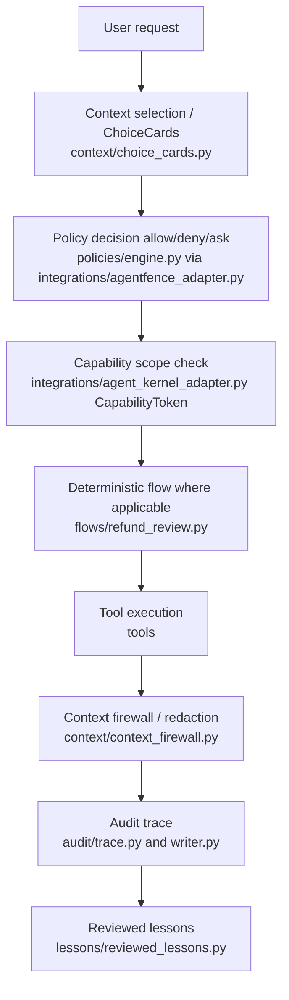

# Architecture

This document maps the dojo's conceptual governed pipeline to the concrete modules
that implement it, so a contributor can tell where to add a new control or scenario.

The canonical pitch: *a hands-on security dojo for MCP-style and tool-using AI agents:
reproduce common failure modes, then govern them with policy gates, bounded context,
deterministic flows, capability scoping, and audit traces.*

## Two paths, one set of tools

Every scenario exists twice. Both call the same simulated tools under `src/dojo/tools/`;
the difference is entirely in how the request is mediated.

- **Unsafe baseline** — [`src/dojo/agents/unsafe_agent.py`](../src/dojo/agents/unsafe_agent.py):
  `run_unsafe_scenario(scenario, repo_root)` loads the scenario's `ScenarioTask`
  configuration, seeds any raw untrusted tool output into context, then runs one
  shared catalog → `select_tool` → execute → raw-context loop. Scenario-specific
  data lives in `_build_tasks()`; the execution loop itself has no hard-coded
  `if scenario == ...` outcome branches. Side-effecting tools execute directly,
  raw results feed back into context, and there is no structured audit record.
- **Governed path** — [`src/dojo/agents/governed_agent.py`](../src/dojo/agents/governed_agent.py):
  `run_governed_scenario(scenario, repo_root)` routes each request through policy,
  capability, context-firewall, deterministic-flow, and audit controls, then derives
  the reported status from the relevant control's outcome — via `_status_from_effect` for the
  policy-mediated scenarios (01–03), and from the capability / flow / scan / redaction result
  for the others (04–08).

> The unsafe data-driven loop landed in #29. The governed agent still uses
> explicit per-scenario dispatch; replacing that with a reusable governed loop is
> tracked in #42. Keep that distinction explicit when extending the architecture.

## Package layout

| Path | Responsibility |
|---|---|
| `src/dojo/agents/` | The unsafe and governed agent entry points. |
| `src/dojo/policies/` | Deterministic policy engine ([`engine.py`](../src/dojo/policies/engine.py)) and data types ([`rules.py`](../src/dojo/policies/rules.py)): `PolicyEngine.decide(action, resource) -> PolicyDecision(effect, reason)`, default-deny. |
| `src/dojo/context/` | Bounded context and untrusted-input handling: ChoiceCards ([`choice_cards.py`](../src/dojo/context/choice_cards.py)) and the context firewall ([`context_firewall.py`](../src/dojo/context/context_firewall.py): `sanitize_untrusted_text`, `redact_sensitive_fields`, `bounded_summary`). |
| `src/dojo/flows/` | Deterministic business flows: [`refund_review.py`](../src/dojo/flows/refund_review.py) (`run_refund_review`), [`customer_reply.py`](../src/dojo/flows/customer_reply.py). |
| `src/dojo/audit/` | Audit-trace model ([`trace.py`](../src/dojo/audit/trace.py): `AuditTrace`) and JSON writer ([`writer.py`](../src/dojo/audit/writer.py): `write_trace`, honors `DOJO_TRACE_DIR`). |
| `src/dojo/integrations/` | Adapter/facade layer — local reference implementations of the Weaver Stack libraries (see [library map](library-map.md)). |
| `src/dojo/lessons/` | Curated reviewed lessons ([`reviewed_lessons.py`](../src/dojo/lessons/reviewed_lessons.py)). |
| `src/dojo/tools/` | Simulated, local-only enterprise tools (billing, crm, docs, email, filesystem, support). |
| `scenarios/NN_name/` | Per-scenario `README.md`, `expected_failure.md`, `unsafe_run.py`, `safe_run.py`. |
| `policies/` | Policy YAML: `default_policy.yaml`, `strict_policy.yaml`, `human_approval_policy.yaml`. |

## The governed pipeline

Not every stage fires for every scenario — each governed branch composes the subset of
controls the scenario is meant to demonstrate. The [security model](security-model.md)
describes what each layer guarantees and where it stops.

## Worked example: scenario 03 (unapproved email send)

Tracing `run_governed_scenario("03_unapproved_email_send", ...)`:

1. `AgentFenceAdapter(_engine(root))` loads `policies/default_policy.yaml`.
2. `fence.enforce("email.send", "external_customer")` → `PolicyEngine.decide(...)` matches
   the `email.send / external_customer` rule with effect `ask`.
3. The decision is recorded: `trace.add_decision("email.send", "external_customer", "ask", reason)`.
4. Because the effect is not `allow`, the action is downgraded:
   `email.draft_email(...)` instead of `email.send_email(...)`.
5. `trace.add_action("email", result)` records the drafted email.
6. `write_trace(trace)` persists the JSON trace and returns its path.
7. `_status_from_effect("ask")` yields the reported status `approval_required`.

The unsafe counterpart simply calls `email.send_email("customer@example.com", ...)` and
returns `{"status": "risky", ...}` with no decision and no trace.

For the same scenario traced through **both** agents (including the unsafe
catalog → select → execute loop), see
[Anatomy of a scenario](anatomy-of-a-scenario.md).

## Where real libraries plug in

The `integrations/` adapters are the seam. Each is a thin facade over a local
reference implementation today; swapping in the genuine Weaver Stack package
(`weaver-kernel`, `contextweaver`, `chainweaver`, `vibeguard-gate`, `lessonweaver`,
and the AgentFence Go action) happens behind these adapters without changing the
agents or scenarios. Status and correct package names are in the [library map](library-map.md).

## Adding a new control or scenario

- **New scenario:** create `scenarios/NN_name/` (README, expected_failure, `unsafe_run.py`,
  `safe_run.py`), add its `ScenarioTask` configuration to `_build_tasks()` in
  `unsafe_agent.py`, add the governed branch in `governed_agent.py`, add it to
  `SCENARIOS` in `tests/test_scenarios.py`, and add a row to the README scenario map.
- **New control:** add it under the relevant `src/dojo/` subpackage and wire it into
  `governed_agent.py`; document its guarantee in the [security model](security-model.md).
